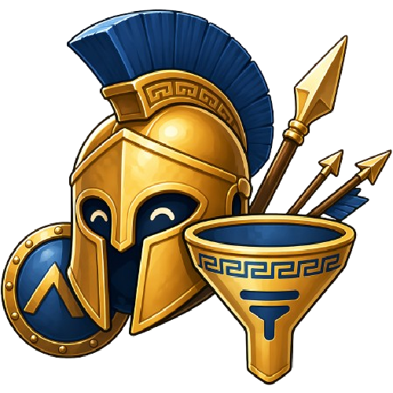

<p align="center">
  
</p>

<h1 align="center">GrepoSentry</h1>

<p align="center">
  Advanced command filter userscript for Grepolis.
</p>

**GrepoSentry** is a Grepolis userscript focused on command overview readability, faster coordination, and cleaner filtering for daily alliance play.

This repository is the **official public review, versioning, and release repository** for the project.

## Project scope

GrepoSentry is designed as a **UI enhancement and command filtering tool** for Grepolis.

Current public versions are focused on:
- outgoing attacks
- incoming attacks
- outgoing supports
- incoming supports
- returns / aborts
- revolts (blue)
- revolts (red)
- conquests / siege movements

The script stores preferences **per server** and keeps them persistent between sessions.

## Technical scope

According to the current metadata and source:
- target pages: `http://*.grepolis.com/game/*` and `https://*.grepolis.com/game/*`
- declared privileged userscript: `GM_addStyle`
- update delivery: `@updateURL` and `@downloadURL`
- public homepage and support URLs are configured in the script header

## Repository purpose

This repository exists to provide:
- transparent source review
- release tracking
- update distribution
- public documentation
- changelog history
- staff review support

## Installation

### Tampermonkey
Install the latest public script from:

- `downloads/GrepoSentry-Command-Filter.user.js`

### Update channel
The script uses:
- `@updateURL`
- `@downloadURL`

so clients can receive newer releases when a new version is published.

## Repository structure

```text
README.md
LICENSE
CHANGELOG.md
SECURITY.md
NOTICE.md
downloads/
assets/
